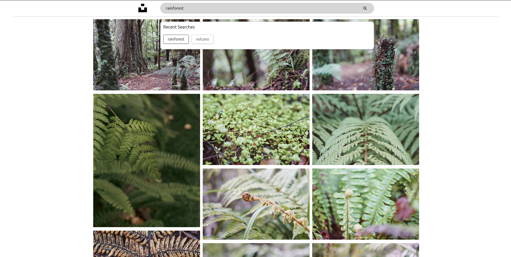

# Gallery App [(view)](https://gallery-app-react-app.onrender.com/)

## Overview

Gallery App is a responsive image gallery application built with React and TypeScript. This app leverages TanStack for efficient caching, Mansory for a dynamic and visually appealing image layout, and the Unsplash API for high-quality images.

## Features

- Responsive Design: Adapts seamlessly to different screen sizes.
- Efficient Caching: Uses TanStack for optimized data fetching and caching.
- Dynamic Layout: Implements Mansory for a fluid and dynamic image layout.
- High-Quality Images: Integrates with the Unsplash API to fetch stunning photos.

## Screenshots




## Installation

Follow these steps to set up and run the Gallery App on your local machine.

Clone the repository:

bash

    git clone https://github.com/SandroK0/gallery-app.git

## Install dependencies:

bash

    cd gallery-app

    npm install

## Start the development server:

bash

    npm start

## Docker

1. Clone this repository:

   ```
   git clone https://github.com/SandroK0/gallery-app.git
   cd gallery-app
   ```

2. Build the Docker containers:

   ```
   docker-compose build
   ```

3. Start the application:

   ```
   docker-compose up
   ```

4. Access the application in your web browser at `http://localhost:3000` (or the appropriate port if you've configured it differently).

To stop the application, press `Ctrl+C` in the terminal where it's running, or run:

```
docker-compose down
```


## Technologies Used

- React: JavaScript library for building user interfaces.
- TypeScript: Superset of JavaScript that adds static typing.
- TanStack: Modern data-fetching and caching library.
- Mansory: JavaScript library for creating dynamic, responsive layouts.

## Project Structure

```
gallery-app/
├── public/
│ ├── index.html
│ └── ...
├── src/
│ ├── assets/
│ ├── Components/
│ ├── Hooks/
│ ├── Types.ts
│ ├── Main.tsx
│ ├── index.tsx
│ └── ...
├── package.json
├── tsconfig.json
└── ...
```
