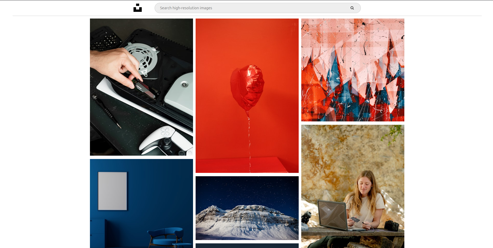
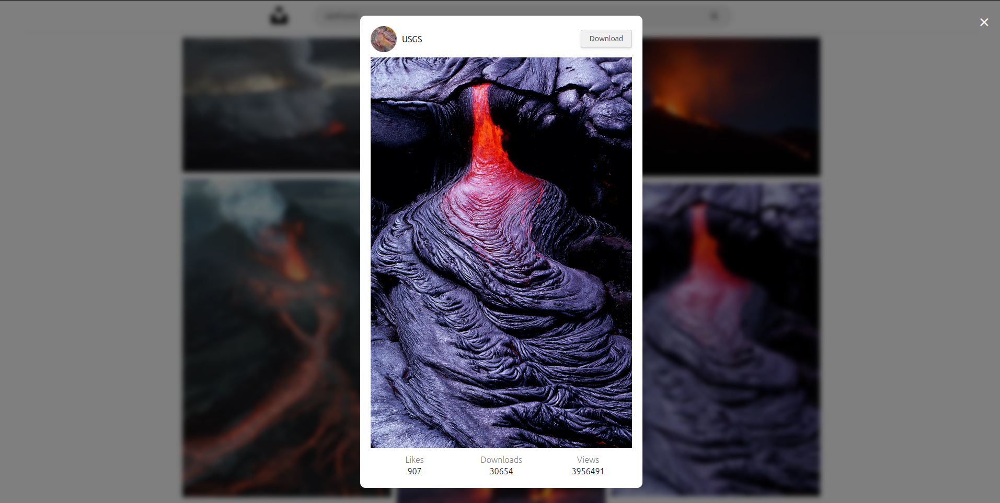
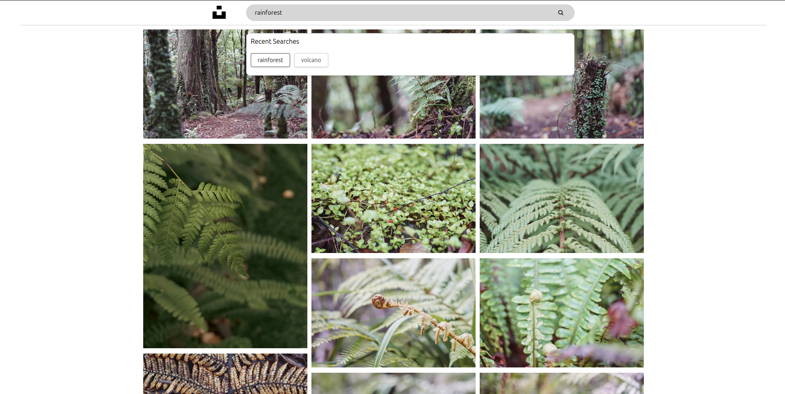

Gallery App

Overview

Gallery App is a modern and responsive image gallery application built with React and TypeScript. This app leverages TanStack for efficient caching, Mansory for a dynamic and visually appealing image layout, and the Unsplash API for high-quality images.
Features

    Responsive Design: Adapts seamlessly to different screen sizes.
    Efficient Caching: Uses TanStack for optimized data fetching and caching.
    Dynamic Layout: Implements Mansory for a fluid and dynamic image layout.
    High-Quality Images: Integrates with the Unsplash API to fetch stunning photos.
    Fast Performance: Ensures quick load times and smooth interactions.
    Easy to Use: Simple and intuitive user interface.

Screenshots

Installation

Follow these steps to set up and run the Gallery App on your local machine.

    Clone the repository:

bash

    git clone https://github.com/SandroK0/gallery-app.git

Install dependencies:

bash

    cd gallery-app
    
    npm install

Start the development server:

bash

    npm start

Technologies Used

    React: JavaScript library for building user interfaces.
    TypeScript: Superset of JavaScript that adds static typing.
    TanStack: Modern data-fetching and caching library.
    Mansory: JavaScript library for creating dynamic, responsive layouts.

Project Structure

gallery-app/
├── public/
│   ├── index.html
│   └── ...
├── src/
│   ├── assets/
│   ├── Components/
│   ├── Hooks/
│   ├── Types.ts
│   ├── Main.tsx
│   ├── index.tsx
│   └── ...
├── package.json
├── tsconfig.json
└── ...
